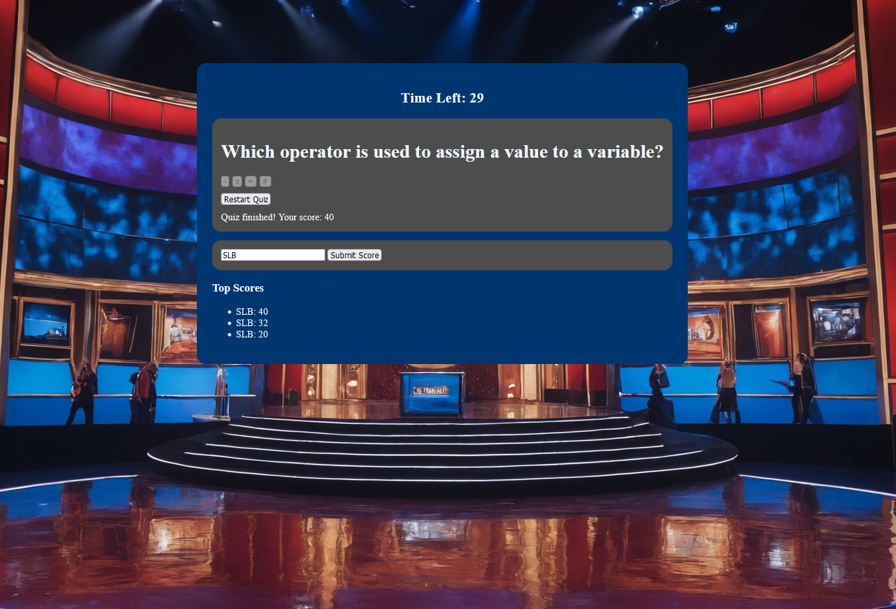

# Shanes-Coding-Quiz

## Task

AS A coding boot camp student
I WANT to take a timed quiz on JavaScript fundamentals that stores high scores
SO THAT I can gauge my progress compared to my peers

## Description

Simple application to quiz the user on Javascript. 
6 questions with a time limit and when you answer incorrectly
it will penalize you with a larger time deduction.  At the 
the user can input thier name and the high scores will be saved

## Application and Github Links 

https://s10skeleton.github.io/Shanes-Coding-Quiz/ 

https://github.com/S10skeleton/Shanes-Coding-Quiz

## Screenshot

